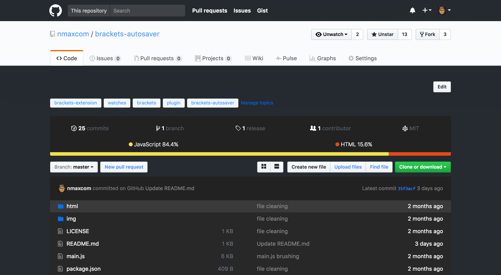

# A customized dark theme for GitHub

I usually work at nights and tend to *paint* the most frequented sites with a la Batman.

GitHub is a giant place and I am in no rush to make it perfect, but it's to a point where almost everything is nice and with few bugs.

I use it with [Stylebot](https://chrome.google.com/webstore/detail/stylebot/oiaejidbmkiecgbjeifoejpgmdaleoha?hl=en) which is great (Chrome). There's also Stylish which works in [Chrome](https://chrome.google.com/webstore/detail/stylish-custom-themes-for/fjnbnpbmkenffdnngjfgmeleoegfcffe?hl=en) and [Firefox](https://addons.mozilla.org/en-US/firefox/addon/stylish/) and I'm sure there are other ways to apply stylesheets in other browsers.

If you like this idea but don't love my personal CSS, [take a look here](https://userstyles.org/styles/browse/github), there are more to choose from.

PS: The file size info on the screencap is from another script of mine (userscript). I'll upload soon here.